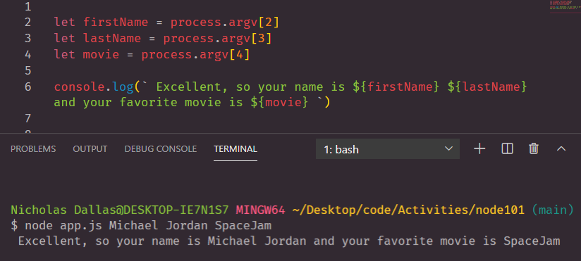
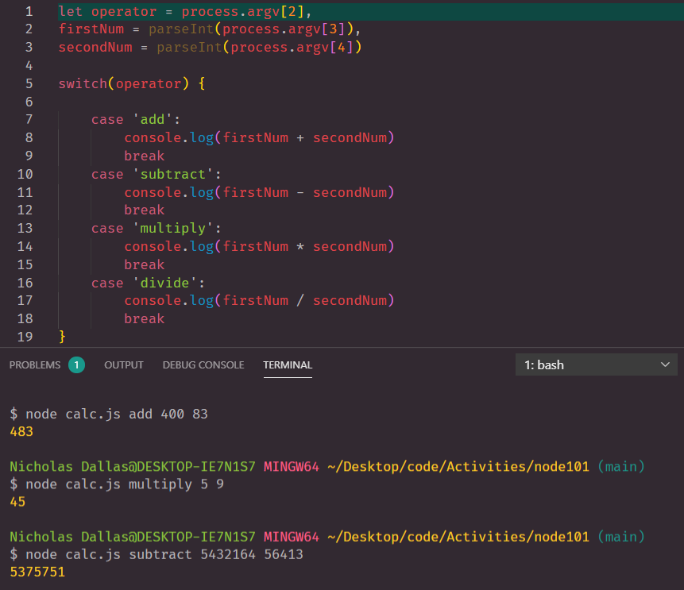
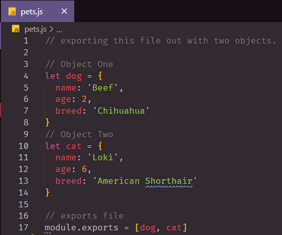
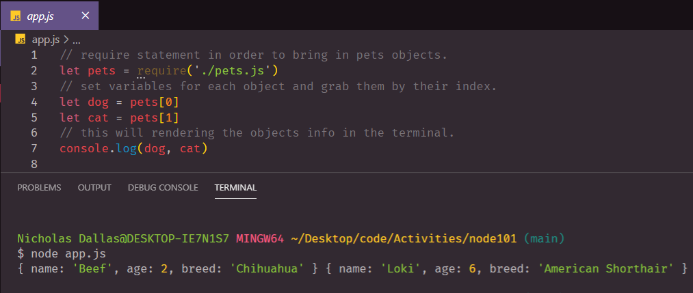

# node101

## About
Node.js is a server base application that can stores and process user information. In this lesson we go over several examples on how to manipulate data in a server.

## What is Node.js?

```
    - Open-source platform 
    - Back-end JS runtime environment 
    - Executes JavaScript code outside the browser
    - Produces dynamic web page content prior to the user seeing it

```

## Running node.js and learning process.argv 

```
    - type node "file name" -> node app.js.
    - process.argv happens when you run any node file. 
    - Globally Scooped API. 
    - Test Data and processes javaScript. 

```

***Figure One***


***Figure Two***


## calc.js File

> Node can also do math 



## Exporting and Importing Modules

```
    - Module.export: Exports out a file and render's it's code when called.         Ex --> module.exports = [x,y]
    - require: Imports a file and executes that code when being called.             Ex --> let var = require('./fileName.js')
```
***Exporting Figure***



***Importing Figure***




## LINKS

- [GitHub Repo Link](https://github.com/nicholasd-uci/node101)
- [Nicholas Dallas GitHub](https://github.com/nicholasd-uci)

- - -
© 2020 NPRD, Nicholas Paul Ruiz Dallas